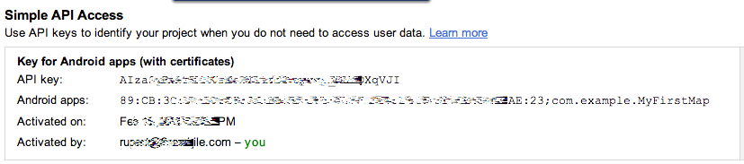

# MyFirstMap

1. Generate a debug certificate's SHA-1 fingerprint Read https://developers.google.com/maps/documentation/android/start#the_google_maps_api_key

    keytool -list -v -keystore ~/.android/debug.keystore -alias androiddebugkey -storepass android -keypass android
    
2. Create a new Google API project, i.e Android Project
3. Services > Google Maps Android API v2 > ON
4. API Access > Create new Android Key)
5. This will generate the API Key in the Simple API Access

